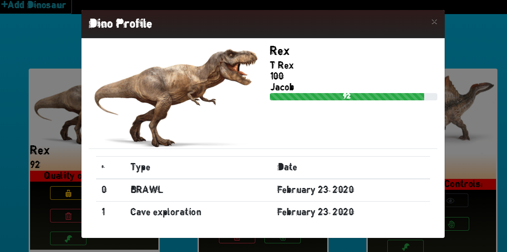
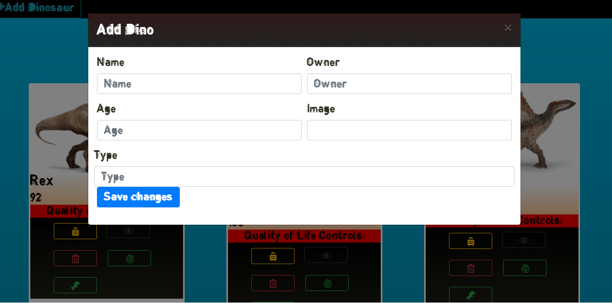

# Week 7 - MILESTONE Project - DINO KENNEL
This was a singular effort of each of us to build an app that would simulate a kind of sims game for dinosaurs

## Motivation
The motivation behind thi project was mainly to assess how far we had come in our development skills. It allowed me to use a lot of the concepts of modular development as well as javascript ES6 in building.

## Build status
MVP complete.

## Code Style
Vanilla Javascript ES6, Jquery, HTML5, CSS3

## Screenshots

*Details Page*


*Form Page*



## URL

[https://dinokennel.netlify.app/](https://dinokennel.netlify.app/)

[](https://app.netlify.com/sites/dinokennel/deploys)

## Features
This site features a way to add dinosaurs, remove dinosaurs, add energy, send on adventures, and view dinosaur details

## Code Example
```
import { findDinoByIndex, getAdventures } from './../helpers/data/sample-data.js'

const sendOnAdventure = (index) => {
    console.log(findDinoByIndex(index));
    findDinoByIndex(index).adventures
        .push({
            id: randomAdventure(index).id, date: new Date().toLocaleDateString().split("/")
        });

}

const randomAdventure = (index) => {
    const myAdventures = getAdventures();
    const myRandom = Math.floor(Math.random() * (myAdventures.length - 1));
    const healthModifier = myAdventures[myRandom].healthHit;
    console.log(healthModifier);
    adventureHit(index, healthModifier)
    return myAdventures[myRandom];
}

const adventureHit = (index, healthModifier) => {
    findDinoByIndex(index).health -= healthModifier;
    console.log("my" + index + "had" + healthModifier + "removed");
}


const adventureFunction = (id) => {
    let adventuredata = [];
    const adventures = getAdventures();
    const dinoadv = id.adventures;
    if (dinoadv.length != 0) {
        dinoadv.forEach((d, index, array) => {


            let adventure = getAdventures().find(dino => {

                if (dino.id.includes(d.id)) {
                    return dino;
                };
            });
            console.log(adventure.title);
            adventuredata.push(
                {
                    id: index,
                    adventure: adventure.title,
                    date: d.date
                });
        });
        return makeTableData(adventuredata);
    } else {
        return "<tr><td>No adventures to show</td></tr>"
    }

}

const makeTableData = (adventuredata) => {
    let myTable = ""
    adventuredata.forEach(ad => {
        myTable += `<tr>
        <td>${ad.id}</td>
        <td>${ad.adventure}</td>
        <td>${ad.date}</td>
        </tr>
        
      `;
    });
    return myTable;
}


export { sendOnAdventure, adventureFunction }
```
## Github owner

[Will Kotheimer](https://github.com/willkotheimer)

